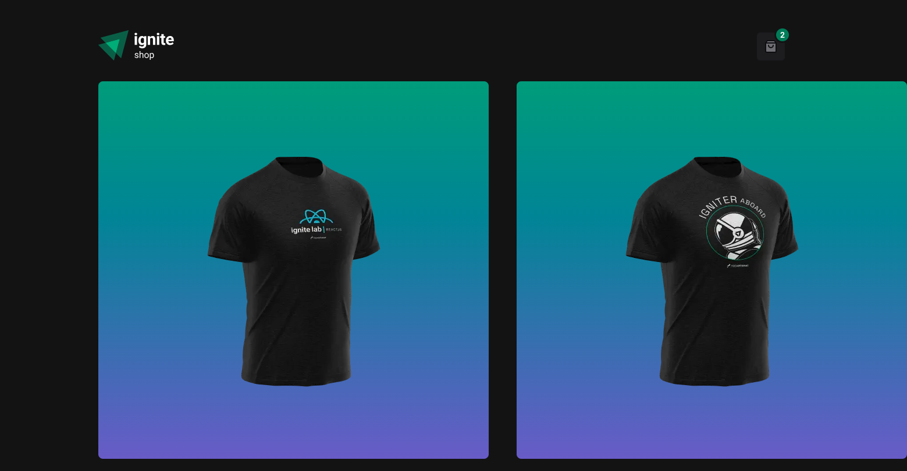

# Ignite Shop




## Description

**Ignite Shop** is a compact, educational e‑commerce demo that showcases a modern web application architecture combining a React-based frontend with server-side payment handling. The project demonstrates how to display products, present detailed product views, manage a client-side shopping cart, and perform secure checkout flows through a payment provider. The user interface emphasizes a simple and responsive shopping experience with clear item listings, an always-accessible mini cart, and a straightforward checkout flow. This repository is intended for learning and experimentation: it is optimized for clarity and teaching best practices rather than production-readiness. When used with test credentials, no real charges are made.

The app allows users to:
- Browse the product catalog with a responsive carousel
- View detailed product pages with images, description and price
- Add products to a mini cart from product pages or the listing
- Increase or decrease item quantities in the cart
- Remove items from the cart
- See a persistent mini cart UI with item list and order summary
- Proceed to a secure Stripe Checkout session to complete payment
- View a purchase confirmation page showing purchased items and totals
- See prices formatted in BRL (local currency)
- Use a responsive interface that adapts to different screen sizes

## Features

- 🖼️ Product listing with responsive slider
- 🛍️ Product detail with add-to-cart behavior
- 🛒 Mini cart UI with item list, summary and checkout button
- 💳 Server-side Stripe integration for listing and checkout sessions
- 💱 Currency formatting helper
- 🎨 Styling using Stitches

## Technologies

- [Next.js](https://nextjs.org/)
- [ReactJS](https://react.dev/learn)
- [TypeScript](https://www.typescriptlang.org/)
- [Stitches](https://stitches.dev/)
- [Keen Slider](https://keen-slider.io/)
- [Use Shopping Cart](https://useshoppingcart.com/)

## API doc's reference
- [Stripe](https://docs.stripe.com/api)

## Getting Started

### Prerequisites

- Node.js v19 or higher
- Stripe account for API keys

### Installation

1. Install dependencies:
    ```bash
    git clone https://github.com/pamelasantoss/ignite-shop.git
    cd ignite-shop
    npm install
    ```

2. Create environment file:
   - Copy `.env.DEFAULT` to `.env.local` and fill values:
     - NEXT_URL (e.g. http://localhost:3000)
     - STRIPE_PUBLIC_KEY
     - STRIPE_SECRET_KEY
   See [.env.DEFAULT](.env.DEFAULT)

3. Run development server:
    ```bash
    npm run dev
    ```

Visit [http://localhost:3000](http://localhost:3000) to view the app.

### Production Build

```bash
npm run build
npm run start
```

## Project Structure

- `src/pages`: Next.js pages and API routes
- `src/components`: React components
- `src/lib`: Service wrappers (e.g, Stripe)
- `src/styles`: Stitches setup and styles
- `src/utils`: helpers (e.g, [`formatPrice`](src/utils/formatPrice.ts))

## Learning Goals

This project was developed to practice and demonstrate:
- Display a product catalog sourced from Stripe with a responsive carousel
- Provide detailed product pages and allow adding items to a client-side mini cart
- Manage cart state (quantities, removal) on the client using a lightweight cart provider
- Create secure server-side Stripe Checkout sessions and redirect users to complete payment
- Show a purchase confirmation page with purchased items and totals, formatted in BRL

## Contributing

Contributions are welcome! Feel free to open issues or submit pull requests.

## Notes for contributors

- Follow existing Stitches patterns in [src/styles/index.ts](src/styles/index.ts)
- Keep server-side Stripe calls secure and never commit secret keys

## Troubleshooting

- If the app fails to run because of Stripe keys, verify `.env.local` contains `STRIPE_SECRET_KEY` and `STRIPE_PUBLIC_KEY`
- For images served by Stripe, [next.config.js](next.config.js) already allows `files.stripe.com`

## License

This project is under the MIT license. See the [LICENSE](https://github.com/pamelasantoss/ignite-shop/blob/main/LICENSE) file for details.

---

Made with ❤️ by [Pamela Santos](https://pamelasantos.dev.br/)
